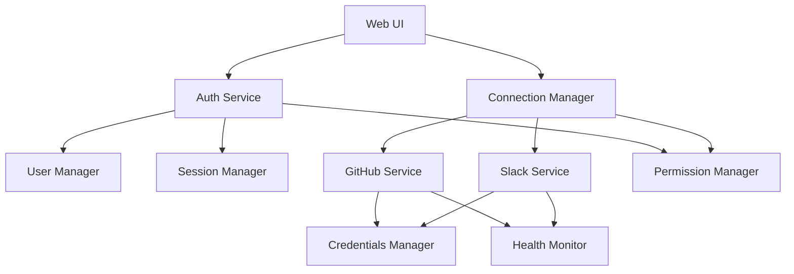
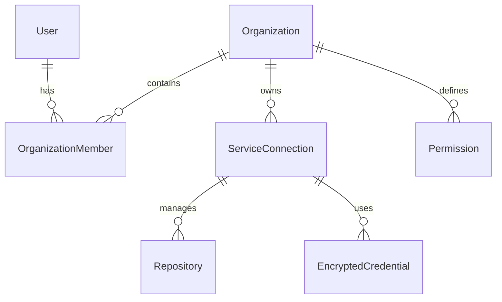
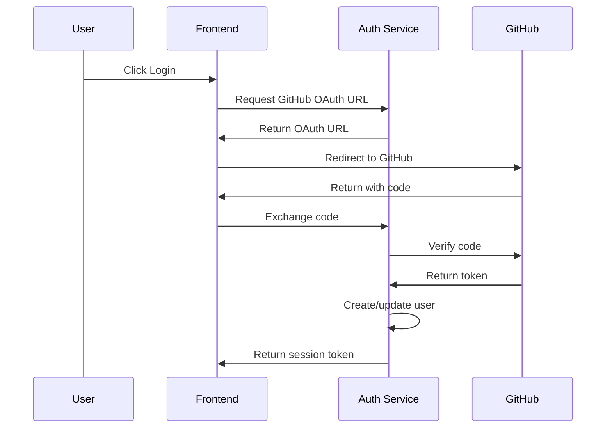
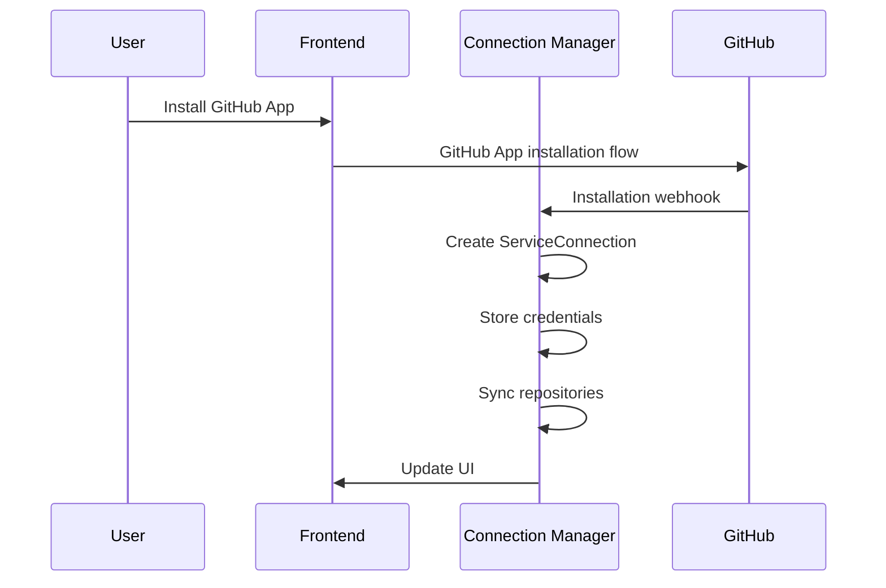

# Authentication and Connections Management Design Document

## 1. Overview

### 1.1 Purpose
This document details the design of RepoPal's authentication and connections management system, which handles:
- User authentication and session management
- GitHub repository connections
- Service integrations (GitHub Apps, Slack)
- Organization management
- Permission system

### 1.2 System Context
This subsystem is a core component of RepoPal, enabling:
- Secure user access to the platform
- Management of repository access
- Integration with external services
- Organization-level resource management
- Audit and compliance tracking

### 1.3 Key Requirements
1. Secure user authentication via GitHub OAuth
2. Management of GitHub App installations
3. Slack workspace integration
4. Organization and team management
5. Fine-grained permission control
6. Audit logging and monitoring
7. Secure credential storage
8. Health monitoring and recovery

## 2. System Architecture

### 2.1 Component Overview


### 2.2 Core Components

#### 2.2.1 Auth Service
- Handles user authentication flows
- Manages user sessions
- Integrates with GitHub OAuth
- Maintains user profile data

#### 2.2.2 Connection Manager
- Manages service connections
- Handles repository registration
- Coordinates service health checks
- Maintains connection states

#### 2.2.3 Credentials Manager
- Secures service credentials
- Manages encryption/decryption
- Handles token rotation
- Stores secrets securely

## 3. Data Model

### 3.1 Core Entities
```python
class User(Base):
    id: str
    github_id: str
    email: str
    name: str
    avatar_url: str
    is_active: bool
    organizations: List[Organization]
    oauth_tokens: List[OAuthToken]

class Organization(Base):
    id: str
    name: str
    github_org_id: str
    members: List[OrganizationMember]
    service_connections: List[ServiceConnection]
    settings: Dict[str, Any]

class ServiceConnection(Base):
    id: str
    organization_id: str
    service_type: str  # 'github_app' or 'slack'
    status: str
    settings: Dict[str, Any]
    credentials: List[EncryptedCredential]
    repositories: List[Repository]

class Repository(Base):
    id: str
    service_connection_id: str
    name: str
    github_id: str
    settings: Dict[str, Any]
    slack_channels: Dict[str, Any]

class Permission(Base):
    id: str
    name: str
    resource_type: str
    description: str
```

### 3.2 Relationships


## 4. Authentication Flow

### 4.1 User Authentication


### 4.2 Service Connection


## 5. Key Workflows

### 5.1 Repository Connection

1. Initial Setup:
```python
async def setup_repository_connection(
    organization_id: str,
    installation_id: str
) -> ServiceConnection:
    # Create service connection
    connection = await create_service_connection(
        organization_id=organization_id,
        service_type='github_app',
        installation_id=installation_id
    )
    
    # Store credentials
    await store_github_credentials(
        connection_id=connection.id,
        installation_id=installation_id
    )
    
    # Sync repositories
    await sync_repositories(connection.id)
    
    return connection
```

2. Repository Sync:
```python
async def sync_repositories(connection_id: str):
    # Get GitHub client
    github = await get_github_client(connection_id)
    
    # Fetch repositories
    repos = await github.get_repositories()
    
    # Update database
    for repo in repos:
        await upsert_repository(
            connection_id=connection_id,
            github_id=repo.id,
            name=repo.full_name,
            settings={
                'default_branch': repo.default_branch,
                'visibility': repo.visibility
            }
        )
```

### 5.2 Slack Integration

1. Workspace Connection:
```python
async def connect_slack_workspace(
    organization_id: str,
    code: str
) -> ServiceConnection:
    # Exchange OAuth code
    credentials = await exchange_slack_code(code)
    
    # Create service connection
    connection = await create_service_connection(
        organization_id=organization_id,
        service_type='slack',
        settings={
            'team_id': credentials.team_id,
            'team_name': credentials.team_name
        }
    )
    
    # Store credentials
    await store_slack_credentials(
        connection_id=connection.id,
        credentials=credentials
    )
    
    return connection
```

2. Channel Mapping:
```python
async def map_slack_channel(
    repository_id: str,
    channel_id: str,
    settings: Dict[str, Any]
):
    repository = await get_repository(repository_id)
    repository.slack_channels[channel_id] = {
        'settings': settings,
        'mapped_at': datetime.utcnow().isoformat()
    }
    await save_repository(repository)
```

## 6. Security

### 6.1 Credential Security

1. Encryption:
```python
class CredentialEncryption:
    def __init__(self, master_key: bytes):
        self.fernet = Fernet(master_key)
    
    def encrypt_credential(self, data: str) -> str:
        return self.fernet.encrypt(data.encode()).decode()
    
    def decrypt_credential(self, encrypted: str) -> str:
        return self.fernet.decrypt(encrypted.encode()).decode()
```

2. Storage:
```python
class EncryptedCredential(Base):
    id: str
    service_connection_id: str
    credential_type: str
    encrypted_data: bytes
    metadata: Dict[str, Any]
```

### 6.2 Permission Management

1. Permission Check:
```python
async def check_permission(
    user_id: str,
    organization_id: str,
    permission: str
) -> bool:
    # Get user's role in organization
    member = await get_organization_member(
        organization_id=organization_id,
        user_id=user_id
    )
    
    if not member:
        return False
    
    # Check role permissions
    return await has_role_permission(
        role=member.role,
        permission=permission,
        organization_id=organization_id
    )
```

## 7. Health Monitoring

### 7.1 Connection Health Checks

1. Health Check System:
```python
class HealthCheck:
    async def check_connection(
        self,
        connection_id: str
    ) -> HealthStatus:
        connection = await get_service_connection(connection_id)
        
        if connection.service_type == 'github_app':
            return await self.check_github_connection(connection)
        elif connection.service_type == 'slack':
            return await self.check_slack_connection(connection)
```

2. Recovery Actions:
```python
class ConnectionRecovery:
    async def recover_connection(
        self,
        connection_id: str,
        error: ConnectionError
    ) -> bool:
        # Attempt recovery based on error type
        if isinstance(error, TokenExpiredError):
            return await self.refresh_token(connection_id)
        elif isinstance(error, WebhookError):
            return await self.recreate_webhook(connection_id)
```

## 8. Monitoring and Auditing

### 8.1 Audit Logging
```python
class AuditLog(Base):
    id: str
    organization_id: str
    user_id: Optional[str]
    action: str
    resource_type: str
    resource_id: str
    details: Dict[str, Any]
    created_at: datetime

async def log_audit_event(
    organization_id: str,
    user_id: Optional[str],
    action: str,
    resource_type: str,
    resource_id: str,
    details: Dict[str, Any]
):
    log = AuditLog(
        organization_id=organization_id,
        user_id=user_id,
        action=action,
        resource_type=resource_type,
        resource_id=resource_id,
        details=details
    )
    await save_audit_log(log)
```

### 8.2 Metrics Collection
```python
class ConnectionMetrics:
    async def collect_metrics(
        self,
        connection_id: str
    ) -> Dict[str, Any]:
        return {
            'api_calls_count': await self.get_api_call_count(connection_id),
            'error_count': await self.get_error_count(connection_id),
            'last_sync': await self.get_last_sync(connection_id),
            'health_status': await self.get_health_status(connection_id)
        }
```

## 9. Configuration Management

### 9.1 Required Configuration
```python
class Config:
    # Authentication
    GITHUB_CLIENT_ID: str
    GITHUB_CLIENT_SECRET: str
    
    # Encryption
    MASTER_KEY: str
    TOKEN_ENCRYPTION_KEY: str
    
    # GitHub App
    GITHUB_APP_ID: str
    GITHUB_APP_PRIVATE_KEY: str
    
    # Slack
    SLACK_CLIENT_ID: str
    SLACK_CLIENT_SECRET: str
    
    # Security
    JWT_SECRET_KEY: str
    SESSION_COOKIE_SECURE: bool
    
    # Monitoring
    HEALTH_CHECK_INTERVAL: int
    METRICS_RETENTION_DAYS: int
```

## 10. API Endpoints

### 10.1 Authentication
```python
@app.route('/auth/github/login')
async def github_login():
    """Initialize GitHub OAuth flow"""

@app.route('/auth/github/callback')
async def github_callback():
    """Handle GitHub OAuth callback"""

@app.route('/auth/logout')
async def logout():
    """Log out user"""
```

### 10.2 Service Connections
```python
@app.route('/api/connections', methods=['GET'])
async def list_connections():
    """List all service connections"""

@app.route('/api/connections/<id>', methods=['GET'])
async def get_connection():
    """Get connection details"""

@app.route('/api/connections/<id>/health')
async def get_connection_health():
    """Get connection health status"""
```

## 11. Implementation Plan

### 11.1 Phase 1: Core Authentication
1. Implement User model and authentication
2. Set up GitHub OAuth flow
3. Implement session management
4. Add basic organization support

### 11.2 Phase 2: Service Connections
1. Implement ServiceConnection model
2. Add GitHub App installation flow
3. Add repository synchronization
4. Implement credential management

### 11.3 Phase 3: Enhanced Features
1. Add Slack integration
2. Implement health monitoring
3. Add audit logging
4. Implement metrics collection

### 11.4 Phase 4: Advanced Features
1. Add connection recovery
2. Implement backup/restore
3. Add advanced monitoring
4. Implement analytics