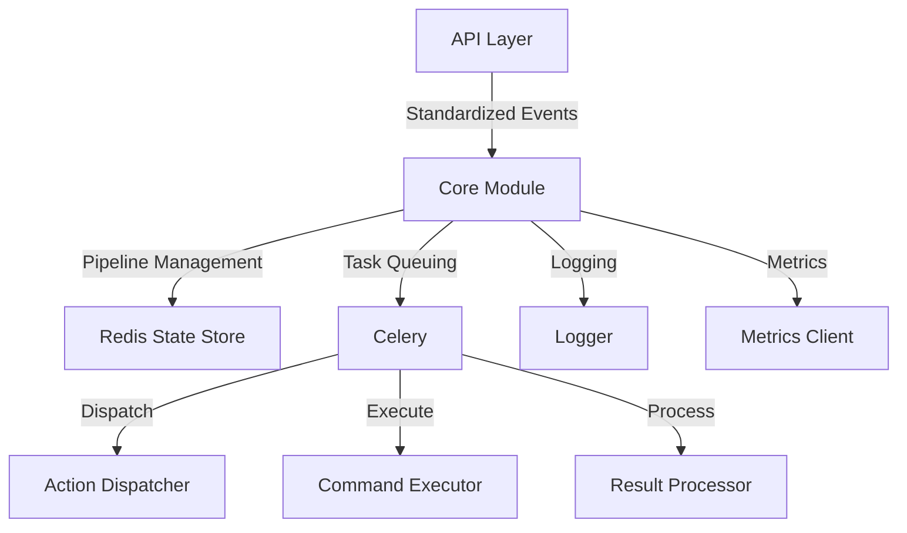

# Core Module Design

## 1. Overview

The Core Module acts as the central orchestrator of RepoPal, managing the asynchronous processing pipeline from standardized events through to result processing. It is responsible for coordinating between different components while maintaining the processing state and ensuring reliable execution.

## 2. System Context



## 3. Primary Responsibilities

1. **Pipeline Management**
   - Create and track processing pipelines
   - Maintain pipeline state in Redis
   - Handle pipeline state transitions
   - Track task execution status

2. **Task Orchestration**
   - Configure Celery task queues
   - Manage task routing
   - Handle task failures and retries
   - Coordinate task chain execution

3. **State Management**
   - Store pipeline state in Redis
   - Track task progression
   - Maintain execution history
   - Handle state transitions

4. **Error Handling**
   - Manage task retries
   - Handle pipeline failures
   - Coordinate error recovery
   - Maintain error states

## 4. Key Components

### 4.1 Celery Configuration
```python
def create_celery_app(flask_app: Flask) -> Celery:
    """Configure Celery for task processing"""
    celery = Celery(
        flask_app.import_name,
        broker=flask_app.config['CELERY_BROKER_URL']
    )
    
    celery.conf.update(
        broker_url=flask_app.config['CELERY_BROKER_URL'],
        result_backend=flask_app.config['CELERY_RESULT_BACKEND'],
        
        # Task routing
        task_routes={
            'process_webhook_event': {'queue': 'events'},
            'dispatch_command': {'queue': 'dispatch'},
            'execute_command': {'queue': 'execute'},
            'process_results': {'queue': 'results'}
        },
        
        # Task timeouts
        task_time_limit=3600,          # 1 hour max
        task_soft_time_limit=3300,     # 55 minutes
        
        # Task settings
        task_retry_delay_start=5,      # Initial retry delay
        task_max_retries=3,            # Maximum retry attempts
        task_ignore_result=False,      # We need results for state tracking
        
        # Worker settings
        worker_prefetch_multiplier=1,  # Process one task at a time
        worker_max_tasks_per_child=100 # Restart worker after 100 tasks
    )
    
    return celery
```

### 4.2 Pipeline State Management
```python
from enum import Enum
from dataclasses import dataclass
from datetime import datetime
from typing import Dict, Optional

class PipelineState(Enum):
    RECEIVED = "received"
    PROCESSING = "processing"
    DISPATCHING = "dispatching"
    EXECUTING = "executing"
    PROCESSING_RESULTS = "processing_results"
    COMPLETED = "completed"
    FAILED = "failed"

@dataclass
class Pipeline:
    pipeline_id: str
    current_state: PipelineState
    current_task_id: Optional[str]
    service: str
    repository: str
    created_at: datetime
    updated_at: datetime
    error: Optional[str] = None
    metadata: Dict[str, Any] = None

class PipelineStateManager:
    def __init__(self, redis_client):
        self.redis = redis_client
        self.key_prefix = "pipeline:"
    
    async def create_pipeline(self, event: StandardizedEvent) -> Pipeline:
        """Create new pipeline for event processing"""
        pipeline = Pipeline(
            pipeline_id=str(uuid.uuid4()),
            current_state=PipelineState.RECEIVED,
            current_task_id=None,
            service=event.service,
            repository=f"{event.repository.owner}/{event.repository.name}",
            created_at=datetime.utcnow(),
            updated_at=datetime.utcnow(),
            metadata={'event_id': event.event_id}
        )
        await self.save_pipeline(pipeline)
        return pipeline
    
    async def update_pipeline_state(self, pipeline_id: str,
                                  new_state: PipelineState,
                                  task_id: Optional[str] = None,
                                  error: Optional[str] = None,
                                  metadata: Optional[Dict] = None):
        """Update pipeline state and metadata"""
        pipeline = await self.get_pipeline(pipeline_id)
        if not pipeline:
            raise PipelineNotFoundError(pipeline_id)
        
        pipeline.current_state = new_state
        pipeline.current_task_id = task_id
        pipeline.updated_at = datetime.utcnow()
        
        if error:
            pipeline.error = error
        if metadata:
            pipeline.metadata.update(metadata)
        
        await self.save_pipeline(pipeline)
```

### 4.3 Core Tasks
```python
@celery.task(bind=True)
def process_webhook_event(self, event: StandardizedEvent, pipeline_id: str):
    """First task: Process webhook event"""
    try:
        state_manager.update_pipeline_state(
            pipeline_id=pipeline_id,
            new_state=PipelineState.PROCESSING,
            task_id=self.request.id
        )
        
        return dispatch_command.delay(
            event=event,
            pipeline_id=pipeline_id
        )
    except Exception as e:
        state_manager.update_pipeline_state(
            pipeline_id=pipeline_id,
            new_state=PipelineState.FAILED,
            task_id=self.request.id,
            error=str(e)
        )
        raise

@celery.task(bind=True)
def dispatch_command(self, event: StandardizedEvent, pipeline_id: str):
    """Second task: Select appropriate command"""
    try:
        state_manager.update_pipeline_state(
            pipeline_id=pipeline_id,
            new_state=PipelineState.DISPATCHING,
            task_id=self.request.id
        )
        
        dispatcher = ActionDispatcher()
        command_request = dispatcher.dispatch(event)
        
        return execute_command.delay(
            command_request=command_request,
            pipeline_id=pipeline_id
        )
    except Exception as e:
        state_manager.update_pipeline_state(
            pipeline_id=pipeline_id,
            new_state=PipelineState.FAILED,
            task_id=self.request.id,
            error=str(e)
        )
        raise

@celery.task(bind=True)
def execute_command(self, command_request: CommandRequest, pipeline_id: str):
    """Third task: Execute the selected command"""
    try:
        state_manager.update_pipeline_state(
            pipeline_id=pipeline_id,
            new_state=PipelineState.EXECUTING,
            task_id=self.request.id
        )
        
        executor = CommandExecutor()
        result = executor.execute_command(command_request)
        
        return process_results.delay(
            execution_result=result,
            pipeline_id=pipeline_id
        )
    except Exception as e:
        state_manager.update_pipeline_state(
            pipeline_id=pipeline_id,
            new_state=PipelineState.FAILED,
            task_id=self.request.id,
            error=str(e)
        )
        raise

@celery.task(bind=True)
def process_results(self, execution_result: ExecutionResult, pipeline_id: str):
    """Fourth task: Process execution results"""
    try:
        state_manager.update_pipeline_state(
            pipeline_id=pipeline_id,
            new_state=PipelineState.PROCESSING_RESULTS,
            task_id=self.request.id
        )
        
        processor = ResultProcessor()
        processor.process_and_notify(execution_result)
        
        state_manager.update_pipeline_state(
            pipeline_id=pipeline_id,
            new_state=PipelineState.COMPLETED,
            task_id=self.request.id,
            metadata={'result_summary': execution_result.summary()}
        )
    except Exception as e:
        state_manager.update_pipeline_state(
            pipeline_id=pipeline_id,
            new_state=PipelineState.FAILED,
            task_id=self.request.id,
            error=str(e)
        )
        raise
```

### 4.4 Error Handling
```python
class CoreError(Exception):
    """Base class for core module errors"""
    pass

class PipelineError(CoreError):
    """Pipeline-related errors"""
    pass

class TaskError(CoreError):
    """Task execution errors"""
    pass

def handle_task_error(task: celery.Task, exc: Exception, 
                     pipeline_id: str, task_id: str):
    """Handle task execution errors"""
    try:
        if is_retryable_error(exc):
            # Update state for retry
            state_manager.update_pipeline_state(
                pipeline_id=pipeline_id,
                new_state=PipelineState.PROCESSING,
                task_id=task_id,
                metadata={'retry_count': task.request.retries}
            )
            # Retry the task
            task.retry(
                exc=exc,
                countdown=exponential_backoff(task.request.retries)
            )
        else:
            # Update state for failure
            state_manager.update_pipeline_state(
                pipeline_id=pipeline_id,
                new_state=PipelineState.FAILED,
                task_id=task_id,
                error=str(exc)
            )
            raise
    except Exception as e:
        state_manager.update_pipeline_state(
            pipeline_id=pipeline_id,
            new_state=PipelineState.FAILED,
            task_id=task_id,
            error=str(e)
        )
        raise
```

## 5. Monitoring and Observability

### 5.1 Pipeline Metrics
```python
class CoreMetrics:
    def __init__(self, metrics_client):
        self.metrics = metrics_client
    
    def record_pipeline_duration(self, pipeline_id: str, duration: float):
        """Record pipeline execution duration"""
        self.metrics.timing(
            'pipeline.duration',
            duration,
            tags={'pipeline_id': pipeline_id}
        )
    
    def record_task_execution(self, task_name: str, duration: float,
                            status: str):
        """Record task execution metrics"""
        self.metrics.timing(
            'task.duration',
            duration,
            tags={
                'task': task_name,
                'status': status
            }
        )
    
    def record_state_transition(self, pipeline_id: str,
                              from_state: PipelineState,
                              to_state: PipelineState):
        """Record pipeline state transitions"""
        self.metrics.increment(
            'pipeline.state_transition',
            tags={
                'pipeline_id': pipeline_id,
                'from_state': from_state.value,
                'to_state': to_state.value
            }
        )
```

### 5.2 Logging
```python
class CoreLogger:
    def __init__(self, logger):
        self.logger = logger
    
    def log_pipeline_event(self, pipeline_id: str, event: str,
                          **kwargs):
        """Log pipeline events"""
        self.logger.info(
            f"Pipeline {pipeline_id}: {event}",
            extra={
                'pipeline_id': pipeline_id,
                'event': event,
                **kwargs
            }
        )
    
    def log_task_event(self, task_name: str, pipeline_id: str,
                       event: str, **kwargs):
        """Log task events"""
        self.logger.info(
            f"Task {task_name}: {event}",
            extra={
                'task_name': task_name,
                'pipeline_id': pipeline_id,
                'event': event,
                **kwargs
            }
        )
```

## 6. Integration Points

1. **With API Layer**
   - Receives standardized events
   - Creates pipelines
   - Initiates processing

2. **With Action Dispatcher**
   - Passes standardized events
   - Receives command requests
   - Handles dispatch errors

3. **With Command Executor**
   - Passes command requests
   - Receives execution results
   - Handles execution errors

4. **With Result Processor**
   - Passes execution results
   - Coordinates notifications
   - Handles processing errors

## 7. Implementation Plan

1. **Phase 1: Basic Pipeline**
   - Setup Celery configuration
   - Implement basic task chain
   - Add simple state tracking

2. **Phase 2: State Management**
   - Implement Redis state store
   - Add state transitions
   - Implement error states

3. **Phase 3: Error Handling**
   - Add retry logic
   - Implement error classification
   - Add recovery strategies

4. **Phase 4: Monitoring**
   - Add metrics collection
   - Implement logging
   - Add health checks