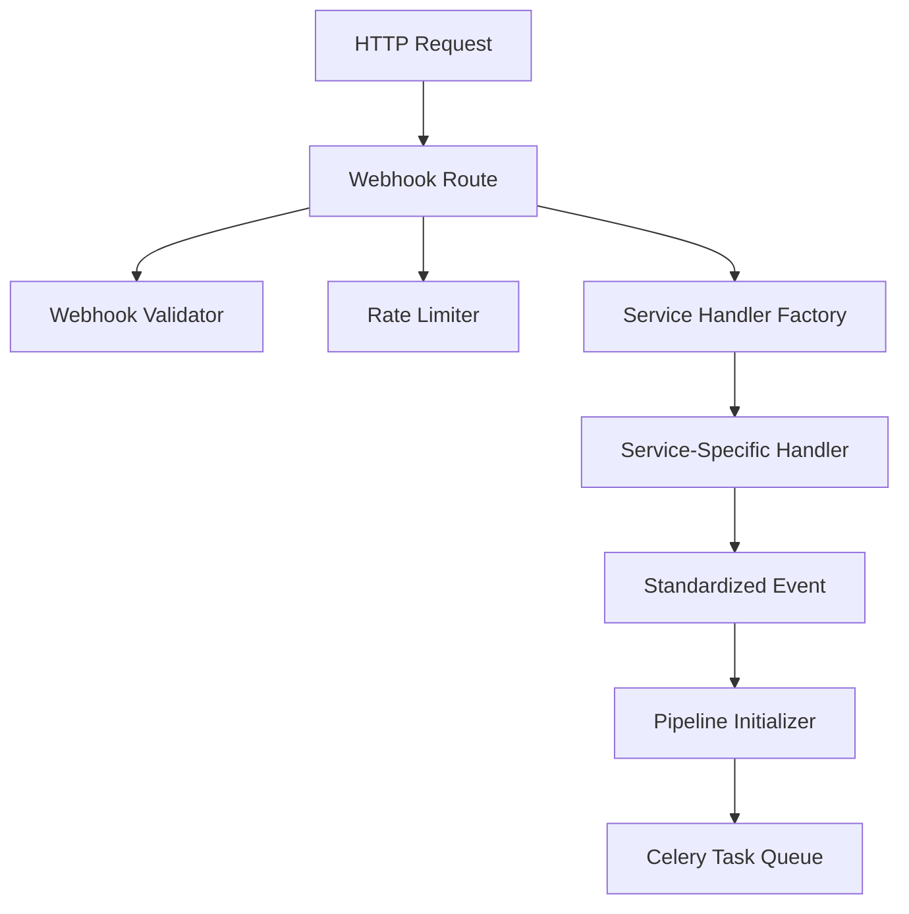

# Webhook and Event Handling System Design

## 1. Overview

The webhook and event handling system is responsible for:
1. Receiving webhooks from various services (GitHub, Slack, Linear)
2. Validating webhook authenticity and structure
3. Converting service-specific webhooks into standardized events
4. Initializing processing pipelines
5. Queuing standardized events for processing

## 2. System Architecture



## 3. Components

### 3.1 Webhook Routes
```python
from flask import Blueprint, request, jsonify, current_app
from .validation import WebhookValidator
from .handlers import ServiceHandlerFactory
from core.pipeline import initialize_pipeline

webhooks = Blueprint('webhooks', __name__)

@webhooks.route('/webhooks/<service>', methods=['POST'])
def webhook_handler(service: str):
    """Main webhook reception endpoint"""
    try:
        # 1. Validate rate limits
        if not rate_limiter.check_limit(service, request):
            return jsonify({'error': 'Rate limit exceeded'}), 429

        # 2. Validate webhook signature
        validator = WebhookValidator()
        if not validator.validate_webhook(service, request):
            return jsonify({'error': 'Invalid signature'}), 401

        # 3. Get appropriate service handler
        handler = ServiceHandlerFactory.create_handler(service)

        # 4. Extract webhook data
        headers = dict(request.headers)
        payload = extract_payload(request)

        # 5. Validate event type
        if not handler.validate_event_type(headers, payload):
            return jsonify({'error': 'Unsupported event type'}), 400

        # 6. Convert to standardized event
        event = handler.standardize_event(headers, payload)

        # 7. Initialize pipeline
        pipeline_id = initialize_pipeline(event)

        # 8. Log and return response
        current_app.logger.info(
            "Webhook processed successfully",
            extra={
                'service': service,
                'event_type': event.event_type,
                'pipeline_id': pipeline_id
            }
        )

        return jsonify({
            'status': 'accepted',
            'pipeline_id': pipeline_id
        }), 202

    except Exception as e:
        current_app.logger.error(
            "Webhook processing failed",
            extra={
                'service': service,
                'error': str(e)
            }
        )
        return jsonify({
            'error': 'Internal server error',
            'message': str(e)
        }), 500
```

### 3.2 Event Standardization
```python
from dataclasses import dataclass
from datetime import datetime
from typing import Dict, Any, Optional

@dataclass
class StandardizedEvent:
    """Unified event format for all services"""
    event_id: str
    service: str
    event_type: str
    repository: RepositoryContext
    user_request: Optional[str]
    created_at: datetime
    metadata: Dict[str, Any]
    raw_headers: Dict[str, str]
    raw_payload: Dict[str, Any]

@dataclass
class RepositoryContext:
    """Repository information for the event"""
    name: str
    owner: str
    default_branch: str
    installation_id: int
    can_write: bool

class ServiceHandler(ABC):
    """Base class for service-specific handlers"""

    @abstractmethod
    def validate_event_type(self, headers: Dict[str, str],
                          payload: Dict[str, Any]) -> bool:
        """Check if event type is supported"""
        pass

    @abstractmethod
    def standardize_event(self, headers: Dict[str, str],
                         payload: Dict[str, Any]) -> StandardizedEvent:
        """Convert service payload to standard format"""
        pass

    @abstractmethod
    def extract_repository_context(self, payload: Dict[str, Any]) -> RepositoryContext:
        """Get repository information from payload"""
        pass
```

### 3.3 Service Handlers

#### GitHub Handler
```python
class GitHubHandler(ServiceHandler):
    """Handles GitHub webhook events"""

    SUPPORTED_EVENTS = {
        'issue_comment',
        'pull_request',
        'push',
    }

    def validate_event_type(self, headers: Dict[str, str],
                          payload: Dict[str, Any]) -> bool:
        event_type = headers.get('X-Github-Event')
        return event_type in self.SUPPORTED_EVENTS

    def standardize_event(self, headers: Dict[str, str],
                         payload: Dict[str, Any]) -> StandardizedEvent:
        repo_context = self.extract_repository_context(payload)

        return StandardizedEvent(
            event_id=headers['X-Github-Delivery'],
            service='github',
            event_type=headers['X-Github-Event'],
            repository=repo_context,
            user_request=self._extract_user_request(payload),
            created_at=datetime.utcnow(),
            metadata=self._extract_metadata(payload),
            raw_headers=headers,
            raw_payload=payload
        )

    def _extract_user_request(self, payload: Dict[str, Any]) -> Optional[str]:
        """Extract user request from payload if present"""
        if 'comment' in payload:
            return payload['comment']['body']
        elif 'pull_request' in payload:
            return payload['pull_request']['body']
        return None

    def _extract_metadata(self, payload: Dict[str, Any]) -> Dict[str, Any]:
        """Extract relevant metadata from payload"""
        return {
            'sender': payload['sender']['login'],
            'action': payload.get('action'),
            'event_timestamp': payload['repository']['updated_at']
        }
```

### 3.4 Pipeline Integration
```python
def initialize_pipeline(event: StandardizedEvent) -> str:
    """Initialize processing pipeline with standardized event"""

    # Create pipeline state entry
    pipeline = state_manager.create_pipeline(
        event_id=event.event_id,
        service=event.service,
        repository=f"{event.repository.owner}/{event.repository.name}"
    )

    # Queue first task in pipeline
    process_webhook_event.delay(
        event=event,
        pipeline_id=pipeline.pipeline_id
    )

    return pipeline.pipeline_id
```

### 3.5 Task Queue Integration
```python
@celery.task(bind=True)
def process_webhook_event(self, event: StandardizedEvent, pipeline_id: str):
    """First task in pipeline - handle standardized event"""
    try:
        state_manager.update_pipeline_state(
            pipeline_id=pipeline_id,
            new_state=PipelineState.PROCESSING
        )

        # Queue the command dispatch task
        return dispatch_command.delay(
            event=event,
            pipeline_id=pipeline_id
        )

    except Exception as e:
        state_manager.update_pipeline_state(
            pipeline_id=pipeline_id,
            new_state=PipelineState.FAILED,
            error=str(e)
        )
        raise
```

## 4. Error Handling

### 4.1 HTTP Layer Errors
```python
class WebhookError(Exception):
    """Base class for webhook errors"""
    status_code = 500

class InvalidSignatureError(WebhookError):
    status_code = 401

class RateLimitError(WebhookError):
    status_code = 429

class UnsupportedEventError(WebhookError):
    status_code = 400

def handle_webhook_error(error: WebhookError):
    """Global error handler for webhook routes"""
    response = jsonify({
        'error': error.__class__.__name__,
        'message': str(error)
    })
    response.status_code = error.status_code
    return response
```

### 4.2 Event Standardization Errors
```python
class EventStandardizationError(Exception):
    """Base class for standardization errors"""
    pass

class InvalidPayloadError(EventStandardizationError):
    """Payload doesn't match expected structure"""
    pass

class RepositoryContextError(EventStandardizationError):
    """Unable to extract repository context"""
    pass
```

## 5. Monitoring

### 5.1 Metrics
```python
class WebhookMetrics:
    def __init__(self, metrics_client):
        self.metrics = metrics_client

    def record_webhook(self, service: str, status: str, duration: float):
        """Record webhook processing metrics"""
        self.metrics.timing(
            'webhook.processing_time',
            duration,
            tags={
                'service': service,
                'status': status
            }
        )

        self.metrics.increment(
            'webhook.received',
            tags={
                'service': service,
                'status': status
            }
        )
```

### 5.2 Logging
```python
class WebhookLogger:
    def __init__(self, logger):
        self.logger = logger

    def log_webhook_received(self, service: str, event_type: str):
        self.logger.info(
            "Webhook received",
            extra={
                'service': service,
                'event_type': event_type
            }
        )

    def log_event_standardized(self, event: StandardizedEvent):
        self.logger.info(
            "Event standardized",
            extra={
                'event_id': event.event_id,
                'service': event.service,
                'repository': f"{event.repository.owner}/{event.repository.name}"
            }
        )
```

## 6. Testing Strategy

1. **Unit Tests**
   - Test each service handler independently
   - Verify event standardization
   - Test error handling

2. **Integration Tests**
   - Test complete webhook flow
   - Verify pipeline initialization
   - Test task queue integration

3. **Load Tests**
   - Test rate limiting
   - Verify concurrent webhook handling
   - Measure performance under load
